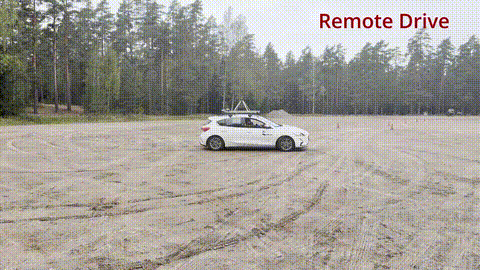

# OptimalDrive: Modular Drive-by-Wire Retrofit Kit

This repository contains the software for the OptimalDrive drive-by-wire retrofit kit, developed at Aalto University. OptimalDrive is a modular, open-source system enabling remote control, semi-autonomous, and fully autonomous operation in virtually any vehicle with an automatic gearbox. The system provides electronic control of throttle, brake, and steering actuators over a CANopen bus, with a Python backend and browser-based frontend for calibration, control, and monitoring.

This software is supplementary material for the article:
> *OptimalDrive: Modular Drive-by-Wire Retrofit Kit* — Pirhonen et al., HardwareX, 2025.

  

---

## Requirements

- [Docker](https://docs.docker.com/engine/install/) (tested on Raspberry Pi OS / Debian 12)

---

## Running

**Production** (with CAN hardware connected):

    docker compose up --build

**Development** (no CAN hardware, enables hot reload):

    DEVELOPMENT=true docker compose up --build

Then open http://localhost in a browser.

To stop:

    Ctrl+C

---

## DEVELOPMENT flag

| DEVELOPMENT | CAN bus | Hot reload |
|---|---|---|
| false (default) | enabled | off |
| true | disabled | on |

In development mode the backend starts without CAN hardware and the web UI connects normally. All actuators will show "Connection lost" which is expected.

---

## Deploying on the target machine (Raspberry Pi)

DBW_start.sh is a convenience script used as a desktop shortcut on the target machine. It starts the Docker containers in a terminal and opens the UI in Firefox kiosk mode automatically.

Note: The path inside DBW_start.sh is hardcoded to /home/optimaldrive/buildtest/DBW. Update this to match wherever you clone the repo on the target machine.

---

## Third-party control (e.g. ROS 2)

The system exposes a WebSocket interface that can be used to control the actuators from any external software, such as a ROS 2 node. Two example ROS 2 nodes are provided in this repository for reference purposes only. These examples demonstrate how to interface with the system but are not intended as production-ready implementations. Users are responsible for ensuring that their own control software is correctly configured, tested, and safe before use with the vehicle.

Warning: Always ensure the emergency stop is functional and a safety driver is present before operating the vehicle with any external control source.